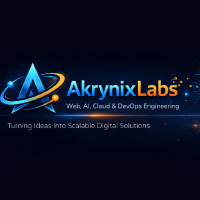

# Akrynix 🚀

**Akrynix** is a modern technology company specializing in the development of scalable digital solutions.

    

We design, develop, and deploy high-quality **web applications**, **mobile apps**, and **cloud infrastructure** for businesses and startups, with a strong focus on reliability, performance, and long-term scalability.

---

## 🚀 What We Do

- 🌐 **Website Development** (Frontend & Backend)
- 📱 **Mobile Application Development**
- 🎨 **UI/UX & Graphic Design**
- ☁️ **Cloud Engineering** (AWS)
- ⚙️ **DevOps & CI/CD Automation**

---

## 🛠️ Tech Stack

### Frontend
- HTML, CSS, JavaScript
- React
- Tailwind CSS

### Backend
- Node.js
- Python

### Mobile
- Flutter

### Cloud & Infrastructure
- AWS (EC2, S3, Lambda, RDS)
- Azure

### DevOps
- Docker
- CI/CD Pipelines
- GitHub Actions

### Version Control
- Git & GitHub

---

## 🎯 Our Goal

To build **reliable**, **scalable**, and **user-focused** digital products while following best practices in **software engineering**, **cloud architecture**, and **DevOps automation**.

---

## 🤝 Contributing

We welcome contributions from team members and collaborators.  
Please review our [CONTRIBUTING.md](../CONTRIBUTION.md) before submitting any pull requests.

---

## 🔐 Security

If you discover a security issue, please follow our responsible disclosure process outlined in [SECURITY.md](../SECURITY.md).

---

## 📫 Contact

For business inquiries, partnerships, or careers, please reach out through official Akrynix channels or email akrynixlabs@gmail.com.

---

© Akrynix. All rights reserved.
